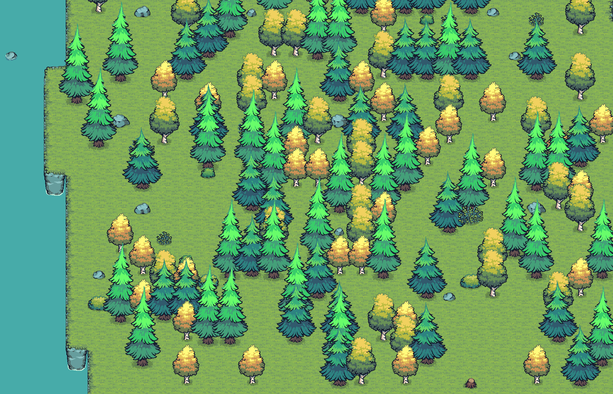

# Tiny Swords Tileset Guide

**Version 0.0.0.6**

A machine-readable usage guide for the **Tiny Swords** terrain tileset
(`Terrain/Tileset`), designed so an IDE / map tool can place tiles correctly and
procedurally generate valid maps. This repo contains the authored guide and
reference imagery only — **not** the Tiny Swords art assets themselves. The pack
is free (name-your-own-price) from its creator **Pixel Frog**; grab it directly:
<https://pixelfrog-assets.itch.io/tiny-swords>.

See **[ROADMAP.md](ROADMAP.md)** for the long-term plan (10 small milestones from
trees/bushes through full-pack coverage).

## Contents

| File | Description |
| --- | --- |
| `guide.json` | The full tileset specification: asset metadata, the RuleTile-style 4-neighbour autotile lookup, elevation system (5 levels + road overlay), cliff/stair/ramp rules, shadow & water-foam placement, the hard placement invariants, and a `propSystem` section documenting the shared decoration/prop-layer behaviours (deterministic scatter, density sampling, collision, y-sort, animation phasing, rendering, layer toggles). |
| `ROADMAP.md` | Long-term roadmap: versioning scheme and incremental milestones (next: **v0.0.1.0 — Road overlay complete**). |
| `Tilemap_color1_grid.png` | `Tilemap_color1` overlaid with a 64×64 grid and **raw row-major sheet IDs (1–54)**. |
| `Tilemap_color1_guide_ids.png` | The same sheet annotated with the **semantic piece IDs** used in `guide.json` (e.g. `FG 5` centre grass, `EG 21` water cliff, `ST 25` ramp top) and each tile's role. |
| `example-map.png` | A rendered 200×200 example map produced from `guide.json` (random multi-elevation terrain with a left-side sea, valley water channels, frequent access ramps, and scattered props including trees, bushes, rocks, gold stones, sheep, and water rocks). |
| `example-preview.gif` / `example-preview.webp` | Animated 28×18-tile crop of the example map. 48-frame loop at 10 fps showing trees, bushes, water foam, water rocks, gold stones, and sheep all cycling through their full Aseprite animations. The WebP is lossless and small; the GIF is included for renderers that cannot display animated WebP. |
| `elevation-examples.html` | Interactive 200×200 elevation showcase and bug-hunt tool: landmark terrain (pyramid, volcano, atoll, moated keep, wall, mountain, terraces, labyrinth, archipelago, stepped staircase, flush lakes), an animated prop layer (trees, bushes, rocks, water rocks, and **roaming sheep** with idle/move/grass states), per-category prop toggles for staged generation, a pause button for animations, pan/zoom viewport, toggles for grid/elevation/tile IDs/labels/shadows, and an in-page adjacency + step violation checker. |
| `elevation-understanding.svg` | Reference diagram for elevation tiers, cliffs, ramps, and stacked rendering. |

## Running the demo

1. Download the **Tiny Swords** pack from [Pixel Frog](https://pixelfrog-assets.itch.io/tiny-swords) and copy the terrain sheet PNGs into `Terrain/Tileset/` (`Tilemap_color1.png` … `Tilemap_color5.png`, `Water Foam.png`, `Water Background color.png`, `Shadow.png`). These files are not included in this repo (see Credits & license).
2. Serve this repo root: `python -m http.server 8000`
3. Open `http://localhost:8000/elevation-examples.html`

Turn on **Labels** and **Violations** to inspect landmarks and rule breaches. Drag or WASD to pan; scroll wheel zooms.

## Animated preview

The static [`example-map.png`](example-map.png) bakes one frame per animated
sprite. The preview above is a 28×18-tile window automatically chosen for prop
variety (trees, bushes, ground rocks, gold stones, sheep, stumps, and a water rock), composited
fresh per frame so foam and animated props loop visibly.

## Per-folder guides

Each asset-pack folder under `TinySwords/` gets its own `guide.json`, mirroring the pack layout:

| Path | Description |
| --- | --- |
| [`guide.json`](guide.json) | Terrain tileset (`Terrain/Tileset`): autotiling, elevation, cliffs, ramps, shadows, foam, plus the shared `propSystem` behaviours for the decoration layer. |
| [`Terrain/Resources/Wood/Trees/guide.json`](Terrain/Resources/Wood/Trees/guide.json) | Animated trees (8-frame, `Trees.aseprite`) and static stumps: anchors, footprints, props render layer, placement rules. |
| [`Terrain/Decorations/Bushes/guide.json`](Terrain/Decorations/Bushes/guide.json) | Animated bushes (8-frame, `Bushes.aseprite`): anchors, footprints, props render layer, placement rules. |
| [`Terrain/Decorations/Rocks/guide.json`](Terrain/Decorations/Rocks/guide.json) | Static ground rocks (`Rock1`–`Rock4`): 64×64 footprints, props render layer, land-only placement rules. |
| [`Terrain/Decorations/Rocks in the Water/guide.json`](Terrain/Decorations/Rocks in the Water/guide.json) | Animated water rocks (16-frame, `Water Rocks_0N.aseprite`): anchors, footprints, props render layer, open-water placement rules. |
| [`Terrain/Resources/Gold/Gold Stones/guide.json`](Terrain/Resources/Gold/Gold%20Stones/guide.json) | Static gold stones with 6-frame highlight rings: anchors, footprints, props render layer, land placement rules. |
| [`Terrain/Resources/Meat/Sheep/guide.json`](Terrain/Resources/Meat/Sheep/guide.json) | Animated sheep idle/move/grass states (4–12 frames, `Sheep.aseprite`): anchors, footprints, props render layer, placement rules, and a `behaviorRules` section documenting the roaming state machine, ramp-only elevation crossing, sprite clearance, walkability, and facing. |

## Key concepts captured in `guide.json`

- **Grid:** every tile is 64×64 px; ground sheets are 576×384 (9×6 cells).
- **Elevation:** 5 levels (`Tilemap_color1`..`color5`, lowest→highest); `color6` is a road overlay, not an elevation.
- **Autotiling:** a 4-neighbour (N/E/S/W) same-elevation bitmask selects the piece via `flatGroundLookup`.
- **South-only cliffs (the big rule):** the art only has **south-facing** cliffs.
  So land elevation may only step **down toward the south**; within any
  horizontal run of land elevation is constant, and any east/west/north
  elevation change must be separated by **water**. (`placementConstraints.elevationGradient`.)
- **Cliffs:** a single base row (pieces 17–20 onto land, 21–24 into water) plus a
  lip substitution gives a consistent 2-tile cliff face; tall drops are stepped
  into 1-tile staircases by the autopad algorithm.
- **Stairs / ramps:** 2-part side ramps bridge exactly one elevation step, with
  side-ramp/cliff-end tile substitutions, a walkable exit apron, and
  facing-side clearance.
- **Accessibility:** every elevated region must reach the tier below via a ramp,
  and `rampDensity` keeps ramps frequent (no cell more than 30 tiles from one).
- **Shadows** sit only under elevated ground; **water foam** rings elevation-0
  shorelines.
- **Prop layer:** decorations (trees, bushes, rocks, water rocks, sheep) scatter
  deterministically from a seeded PRNG onto interior grass, are y-sorted, and
  carry random animation phase offsets so nothing animates in lockstep. Solid
  props block walkers; sheep roam with a state machine and may only change
  elevation via ramps. See `propSystem` (terrain `guide.json`) and `behaviorRules`
  (Sheep `guide.json`). These are reference specs for the demo's behaviour — they
  describe the JS implementation rather than being auto-loaded at runtime.

## Versioning

`0.0.0.1` — first snapshot of the terrain tileset guide (autotiling, elevation,
cliffs, stairs/ramps, shadows, foam, placement invariants, ramp density) with
annotated reference sheets and a rendered example map.

`0.0.0.2` — trees and bushes: per-folder guides for animated trees/stumps and
animated bushes (anchors, footprints, props layer, placement rules); example map
renderer scatters y-sorted props on interior grass.

`0.0.0.3` — rocks: per-folder guides for static ground rocks and animated water
rocks (footprints, land vs water placement, 16-frame water-rock animation); example
map renderer scatters ground rocks on interior grass and water rocks on open water.

`0.0.0.4` — resource semantics (visuals): gold stones with highlight animations and
sheep idle/move/grass states; example map renderer scatters gold stones and sheep on
interior grass.

`0.0.0.5` — interactive elevation showcase: `elevation-examples.html` with a 200×200
bug-hunt map (landmarks, flush lakes at any tier, omnidirectional autopad, terraced
staircase with open ramp access, stacked-tier rendering, pan/zoom UI, and in-page
violation checker against `piece_adjacency_allowed.json`).

`0.0.0.6` — animated prop layer + behaviour docs: the showcase gains a live
decoration layer (trees, bushes, rocks, water rocks, and roaming sheep with
idle/move/grass states), per-category toggles for staged generation, and a pause
button. The runtime rules are documented as reference specs — a `propSystem`
section in the terrain `guide.json` (deterministic scatter, density sampling,
collision, y-sort, animation phasing, rendering, layer toggles) and a
`behaviorRules` section in the Sheep `guide.json` (roaming state machine,
ramp-only elevation crossing, sprite clearance, walkability, facing).

**Next:** `0.0.1.0` — road overlay complete ([ROADMAP.md](ROADMAP.md)).

## Credits & license

The terrain tiles described by this guide are from the **Tiny Swords** asset
pack by **Pixel Frog**:

- Asset pack: <https://pixelfrog-assets.itch.io/tiny-swords>
- Author: Pixel Frog — <https://pixelfrog-assets.itch.io>

All credit for the artwork goes to Pixel Frog. Crediting isn't required by the
license, but it helps and is always welcome.

**Asset license (quoted from the Tiny Swords page):**

> Feel free to use this asset pack in both personal and commercial projects,
> modifying the assets as needed.
> Crediting is not required, but it helps and is always welcome.
> You may not redistribute, resell, or repackage the assets, even if the files
> are modified.
